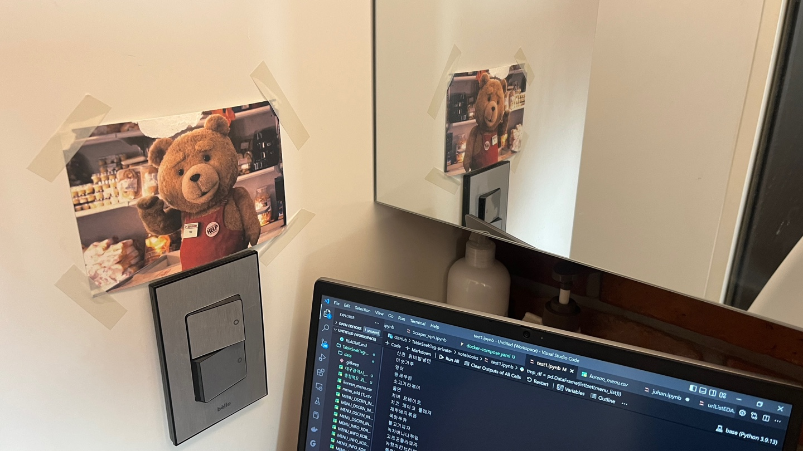

<!DOCTYPE html>
<html lang="en">
<head>
    <meta charset="UTF-8">

  
</head>
  
<body>
  
  
# Algorithm every day 👉   
 
  

 

 

* [ETC](https://github.com/LearningnRunning/Algorithm/tree/main/ETC)

 

* [Level 2](https://github.com/LearningnRunning/Algorithm/tree/main/programmers/Level2)  
* [Level 3](https://github.com/LearningnRunning/Algorithm/tree/main/programmers/Level3)

<!--  -->

</body>
